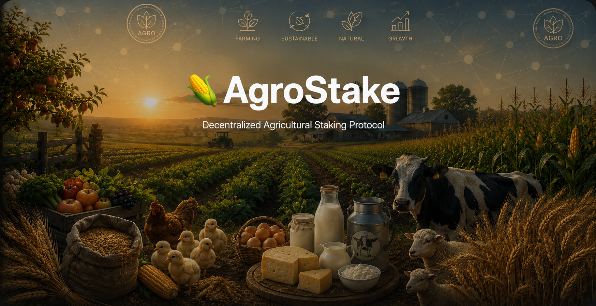
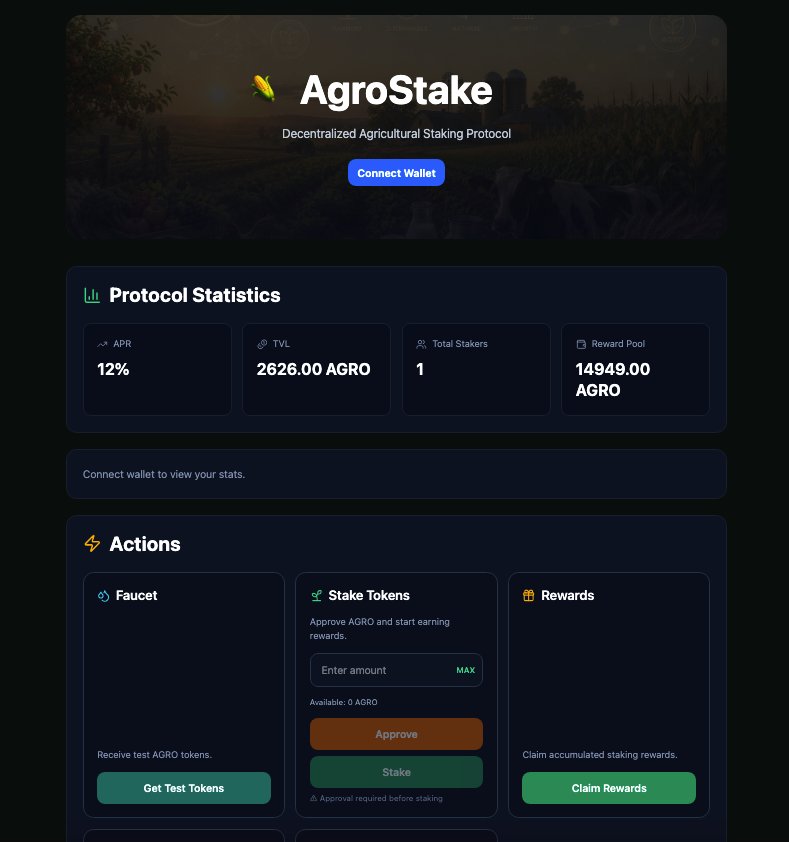
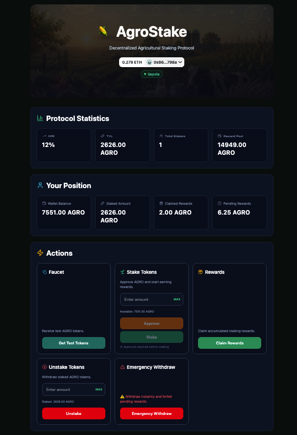
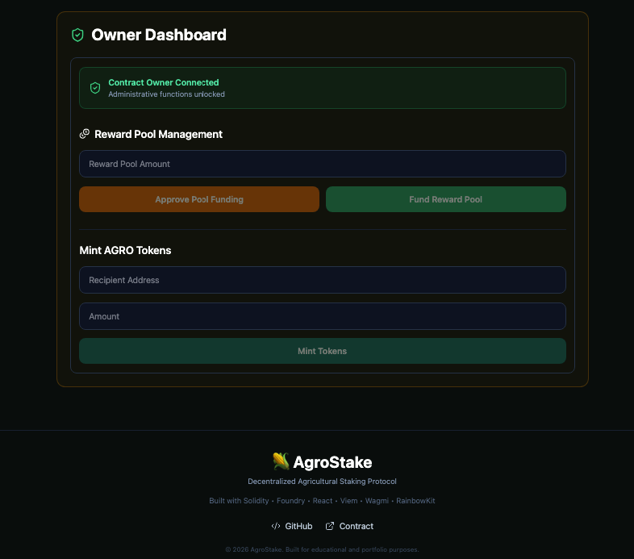

<p align="center">



<p>
Decentralized Agricultural Staking Protocol
</p>

<p>
<strong>Built with Solidity • Foundry • React • Viem • Wagmi</strong>
</p>


</p>

---

# 🌽 AgroStake

A full-stack staking dApp built with Solidity, Foundry, React, Wagmi, Viem and RainbowKit.

AgroStake is a decentralized staking protocol deployed on Ethereum Sepolia. Users can receive test AGRO tokens, stake them, earn fixed APR rewards, claim rewards, unstake tokens and interact with an owner dashboard for protocol administration.

---

## 🚀 Live Demo

https://agrostake-dapp.vercel.app/

---

## 📸 Screenshots

### Homepage



### Connected Wallet



### Owner Dashboard



---

## ✨ Features

- Connect wallet with RainbowKit
- Stake AGRO tokens
- Fixed APR rewards
- Claim staking rewards
- Partial unstake
- Emergency withdraw
- Faucet for test tokens
- Owner dashboard
- Reward pool management
- Mint AGRO tokens
- Transaction status tracking
- Toast notifications
- Skeleton loading
- Network Guard
- Sepolia Network Badge
- MAX buttons
- Responsive UI built with TailwindCSS

---

## 🛠 Tech Stack

### Smart Contracts

- Solidity
- Foundry
- OpenZeppelin

### Frontend

- React
- TypeScript
- Vite
- Wagmi
- Viem
- RainbowKit
- TailwindCSS

### Network

- Ethereum Sepolia

---

## 📦 Smart Contracts

### AgroStaking

```text
0x1544ccC232A4a0D183C07B86E8EAe5A35419A831
```

### AgroToken

```text
0x4F268d1f3f616D7BD5727E1ef996996B530e5527
```

### Etherscan

Staking Contract

https://sepolia.etherscan.io/address/0x1544ccC232A4a0D183C07B86E8EAe5A35419A831

Token Contract

https://sepolia.etherscan.io/address/0x4F268d1f3f616D7BD5727E1ef996996B530e5527

---

## ⚙️ Installation

Clone the repository:

```bash
git clone https://github.com/andrei-iarovoi/agrostake-dapp.git
```

Install frontend dependencies:

```bash
cd frontend
npm install
```

Run frontend locally:

```bash
npm run dev
```

---

## 🧪 Smart Contract Testing

Run Foundry tests:

```bash
forge test
```

Run formatting checks:

```bash
forge fmt --check
```

Build contracts:

```bash
forge build
```

---

## 📁 Project Structure

```text
agrostake-dapp/
├── smart-contracts/
│   ├── src/
│   ├── script/
│   ├── test/
│   └── README.md
├── frontend/
│   ├── src/
│   ├── public/
│   └── README.md
├── screenshots/
└── README.md
```

---

## 📄 License

MIT License
